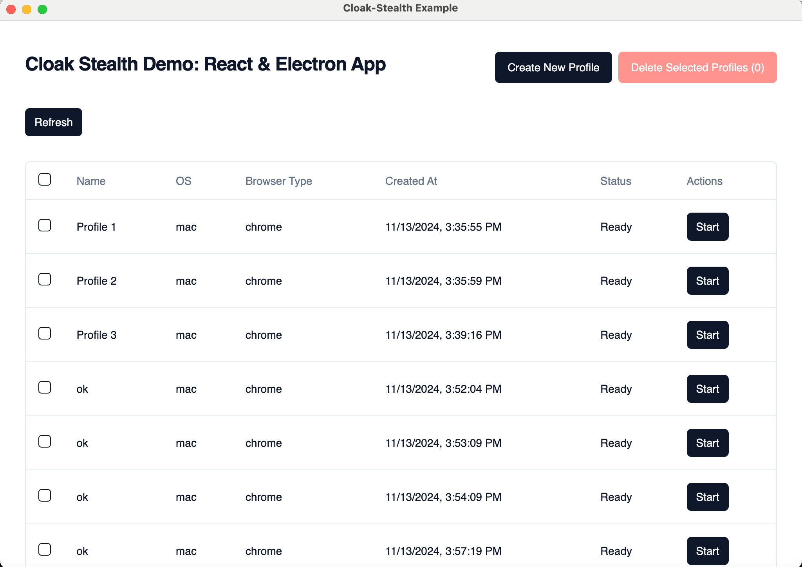
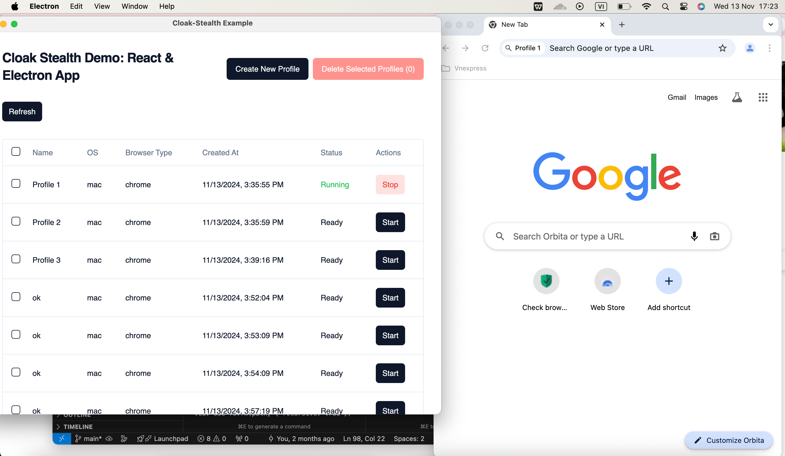

# Antidetect Browser Demo with Cloak-Stealth Integration

This is a demo application of an antidetect browser using the cloak-stealth library. The browser helps prevent fingerprinting and tracking by masking browser fingerprints and managing multiple profiles.

## Installation

```bash
npm install cloak-stealth
```

[Watch Demo Video](https://www.youtube.com/watch?v=GPwgbju9_P4)


## Demo Screenshots




## Demo Animation


## Features

- Advanced browser fingerprint protection
- Multiple browser profile management
- Cookie and cache isolation
- WebRTC leak prevention
- Proxy support
- Easy integration with cloak-stealth library
- Simple and clean user interface
- Real-time demonstration of stealth capabilities

## Getting Started

1. Install the dependencies
2. Configure your browser profiles and proxy settings
3. Run the application

## Security Notice

This antidetect browser is designed for legitimate privacy protection purposes. Users are responsible for complying with all applicable laws and regulations.
